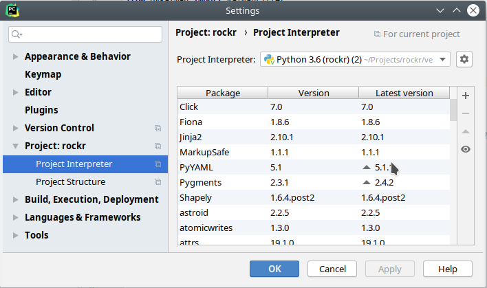
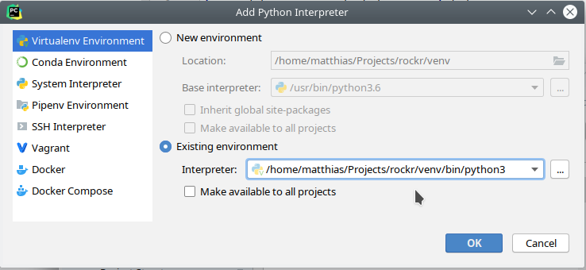

# kickstart-flavor py3 :: Python3 development container

see (http://github.com/infracamp/kickstart) for more information.

Document Index:

- [Development Guide for this flavor](DEVELOPMENT.md)
- [Dockerhub page](https://hub.docker.com/r/infracamp/kickstart-flavor-py3/)
    - [Tags available](https://hub.docker.com/r/infracamp/kickstart-flavor-py3/tags/)
    - [Build details](https://hub.docker.com/r/infracamp/kickstart-flavor-py3/builds/)


## Using the container

```
from: infracamp/kickstart-flavor-py3
```

### Using virtual environments

We assume you created a virtual environment under `/opt/venv`. (Using python3 default `venv` module).

```yaml
from: infracamp/kickstart-flavor-py3:testing
env:
  VIRTUAL_ENV: /opt/venv
  PATH: "/opt/venv/bin:$PATH"

command:
  build:
    "/usr/bin/python3 -m venv /opt/venv"
    "pip install -r /opt/requirements.txt"
```


## Setup PyCharm

Let's assume we have a virtual-env in `venv`:






